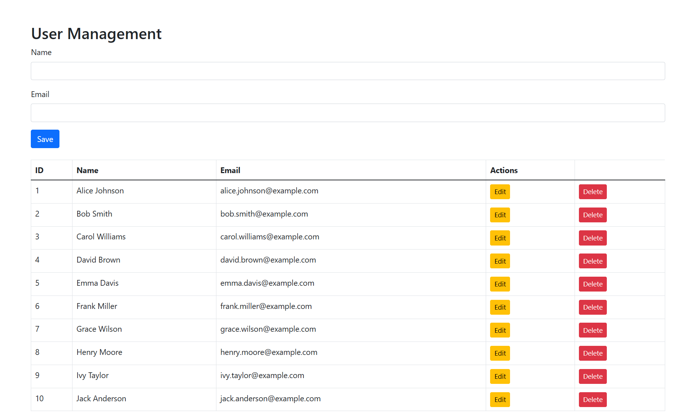

# PHP Legacy CRUD Application

A practical CRUD (Create, Read, Update, Delete) application built with **Procedural PHP**, demonstrating essential skills for maintaining and modernizing legacy web systems.

## 🛠️ Built With

*   **Back-end:** Procedural PHP
*   **Front-end:** Bootstrap 5, JavaScript
*   **Database:** MySQL (using MySQLi)
*   **Security:** SQL injection prevention, XSS prevention, POST request validation.

## 📋 Features

*   **Create:** Add new records to the database.
*   **Read:** Display all records in a paginated table.
*   **Update:** Edit existing records.
*   **Delete:** Remove records with confirmation.
*   **Form Validation:** Basic input validation on server-side.
*   **Responsive Design:** Works on desktop and mobile devices.

## 🚀 Getting Started

### Prerequisites

*   A local web server (e.g., XAMPP, WAMP)
*   PHP (version 7.4 or higher)
*   MySQL

### Installation

1.  Clone this repository to your web server's `htdocs` folder:
    ```bash
    git clone https://github.com/iurecastro/php-legacy-crud.git
    ```

2.  **Database Setup:**
    *   Create a MySQL database named `crud_example`.
    *   Import the provided SQL file or run this query to create the `users` table:
    ```sql
    CREATE TABLE users (
        id INT AUTO_INCREMENT PRIMARY KEY,
        name VARCHAR(100) NOT NULL,
        email VARCHAR(100) NOT NULL UNIQUE
    );
    ```

3.  **Configuration:**
    *   Navigate to the project folder.
    *   Open `config.php` and update the database credentials with your own:
    ```php
    $host = 'localhost';
    $user = 'your_db_username';
    $password = 'your_db_password';
    $database = 'crud_example';
    ```

4.  **Run the Application:**
    *   Open your browser and go to `http://localhost/php-legacy-crud/`.
    *   You should see the application running.

## 📸 Application Preview


*The main interface of the CRUD application showing a list of sample users.*

## 🔧 Code Overview

This project follows a classic procedural PHP structure, ideal for understanding legacy codebases:

*   **`index.php`** - Main file that displays records and the form.
*   **`create.php`** - Handles form submission for creating new records.
*   **`read.php`** - Fetches a single record for editing (if needed).
*   **`update.php`** - Processes updates to existing records.
*   **`delete.php`** - Handles record deletion.
*   **`config.php`** - Database connection settings (not versioned for security).

## 🎯 Purpose

This project showcases the ability to work with and maintain traditional PHP applications, a common requirement for many businesses with established systems. It highlights skills in:

*   Procedural PHP programming
*   MySQL database interaction
*   Form handling and validation
*   Basic security practices (SQL injection prevention, XSS protection)

## 👨‍💻 Author

**Iure Castro** - [LinkedIn](https://www.linkedin.com/in/iurecastro/) | [Website](https://iure.uk)

---

**Note:** This is a demonstration project for portfolio purposes.
